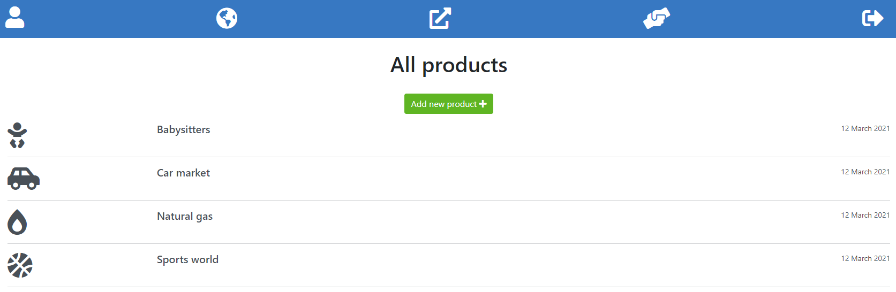

#  🧐 Investment groups (Web Application)

This app is my capstone for Ruby on Rails Microverse module. This includes a sign in basic structure, investment control, group administration and all the forms and other necessary things to all the perfect functionality.

 

 

## 🔴 Demos

[Live Demo]()

[Video Demo]()

## Tests with RSpec 

This website was tested with [Rspec](https://en.wikipedia.org/wiki/RSpec)

## 🔧 Built With these features
- Ruby 2.7.2
- Rails 6.1.3
- PostgreSQL
- Using Rubocop Linters
- Bootstrap
- Font awesome
- SASS

## 🛠 Getting Started
## Install

```git clone https://github.com/vichuge/rails_capstone_investments.git``` on your terminal.

## Run the application
To get a local copy up and running follow these simple example steps.

- Open a terminal
- Copy this code : ```git clone "put the link from github repo"```
- Run the program with this code : ```bundle install```
- before running ```rails server``` you must run a few more commands: first run ```yarn install --check-files```
- Then run ```rails db:create```, ```rails db:migrate```
- now you can run ```rails server```
- Stop the program with: "Ctrl + C" (Windows or Linux) or "Command + C"(Apple)

## Open app in browser

- When the program is running go to your browser.
- put: localhost:3000/
- Click on Sign Up, then register and create a new User
- Enjoy the app.

## ✒️ Author

👤 **Victor Pacheco**

- GitHub: [@vichuge](https://github.com/vichuge)
- LinkedIn: [LinkedIn](https://www.linkedin.com/in/victor-pacheco-7946aab2/)
- Twitter: [@Pachecofloresv](https://twitter.com/Pachecofloresv)

## 🤝 Contributing
Contributions, issues and feature requests are welcome!

Feel free to check the [issues page](https://github.com/vichuge/rails_capstone_investments/issues).

## 📝 License
This project is [MIT](./LICENSE) licensed.